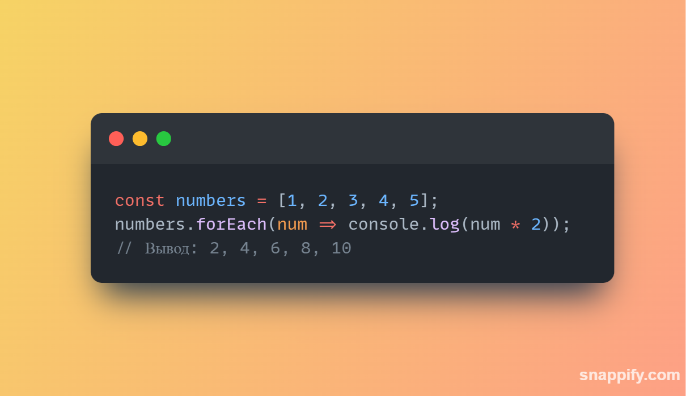

# Callbacks в JS

## Callbacks — это функции, которые передаются в другие функции как аргументы и вызываются внутри этих функций. Они являются основой асинхронного программирования в JavaScript и широко используются в различных сценариях.
# 1. forEach
## Метод forEach выполняет предоставленную функцию один раз для каждого элемента массива. Он не возвращает новый массив.

# 2. map
## Метод map создает новый массив с результатами вызова предоставленной функции для каждого элемента.
-1.png>)
# 3. reduce
## Метод reduce применяет функцию к аккумулятору и каждому элементу массива (слева направо), чтобы свести его к одному значению.
-1.png>)
# 4. find
## Метод find возвращает первое значение в массиве, которое удовлетворяет предоставленной функции тестирования. Если ни один элемент не удовлетворяет функции тестирования, возвращается undefined.
-1.png>)
# 5. filter
## Метод filter создает новый массив со всеми элементами, которые проходят проверку, реализованную предоставленной функцией.
-1.png>)
# 6. toSorted
## Метод toSorted сортирует массив по предоставленному сравнительному значению.
-1.png>)
